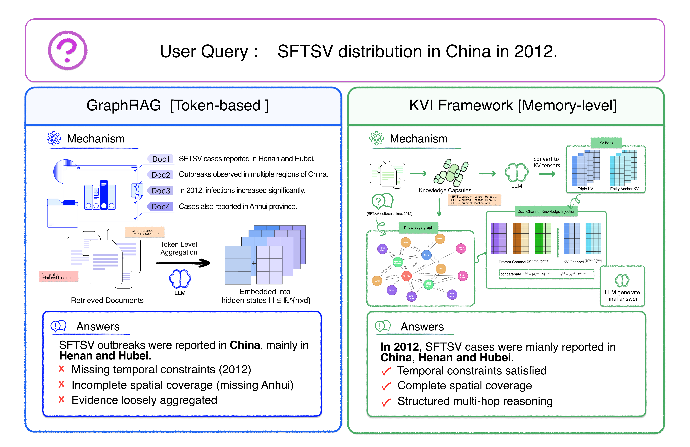
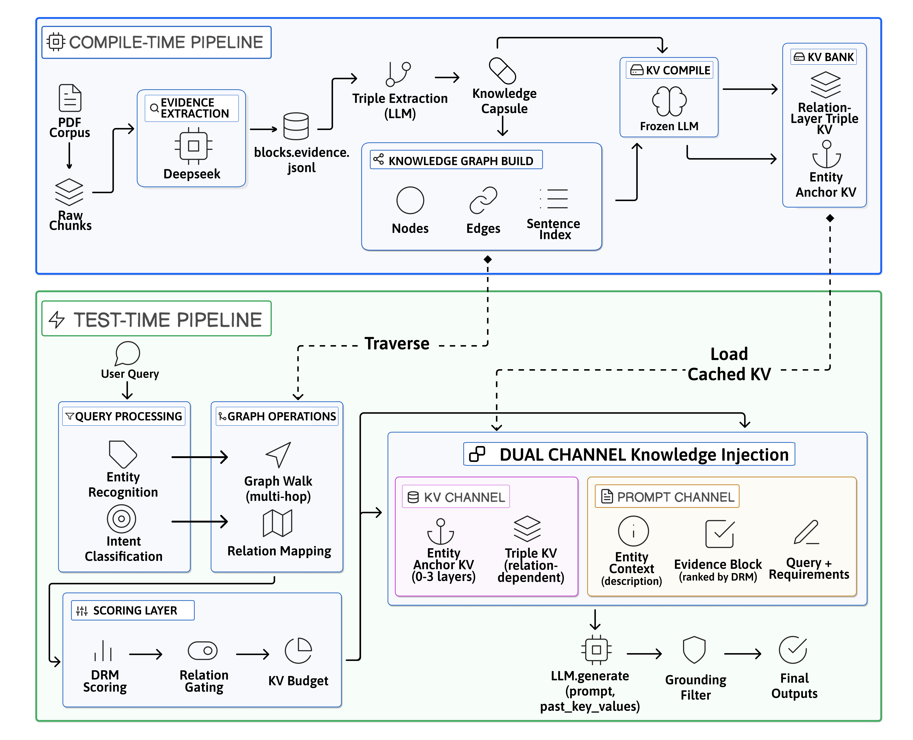

# Knowledge Capsules

**Knowledge Capsules: Memory-Level Knowledge Integration via External Key-Value Injection**

[Paper](https://arxiv.org/abs/2604.20487)

This repository contains the reference implementation for **Knowledge Capsules**, a training-free framework for injecting external knowledge into frozen large language models through **attention-compatible key-value memory**, rather than relying only on prompt-side context expansion.

## Background and Motivation

Large language models store most knowledge in parametric weights, which makes updating domain knowledge expensive and slow. Retrieval-augmented generation (RAG) improves this by appending retrieved passages to the prompt, but retrieved evidence still competes with all other tokens inside the context window. In long-context and multi-hop settings, this often leads to unstable evidence usage, weak relational control, and inconsistent reasoning.

**Knowledge Capsules** address this mismatch by moving external knowledge from the **context level** to the **memory level**. Instead of treating knowledge as raw text only, the framework compiles structured relational evidence into external key-value tensors that can participate directly in Transformer attention. The result is a dual-channel design:

- **Prompt channel** for grounded textual evidence
- **Memory channel** for structured capsule injection through external KV states

This shift improves controllability, stability, and multi-hop reasoning while preserving a frozen backbone model.



## Why It Matters

- **Training-free knowledge extension**: add or refresh external knowledge without fine-tuning the base LLM
- **More stable reasoning**: structured memory injection reduces the fragility of long prompt concatenation
- **Evidence-grounded outputs**: retrieved passages remain visible for grounding, attribution, and verification
- **Better multi-hop behavior**: graph-guided retrieval and capsule injection work together instead of overloading a flat prompt

## Functional Modules

The repository is organized around an end-to-end pipeline documented in [`docs/90_experiment_runbook_linux.md`](docs/90_experiment_runbook_linux.md), from corpus construction to runtime injection and evaluation.



### 1. Corpus ingestion and raw context building

- Ingest PDF documents with optional OCR support for scanned files
- Clean, deduplicate, and normalize source text
- Build long-form `raw_chunks` and shorter `blocks` for downstream indexing and compilation

Core components include `src/pdf_ingestion.py`, `src/chunking.py`, `src/cleaning_and_dedupe.py`, and the pipeline scripts under `scripts/`.

### 2. Topic-aware evidence extraction

- Build topic-specific corpora from document collections
- Optionally filter low-knowledge paragraphs with DeepSeek-based content filtering
- Extract evidence-oriented blocks and document metadata for grounded retrieval

This workflow is reflected in scripts such as:

- `scripts/build_raw_context_from_pdfs.py`
- `scripts/build_evidence_blocks_from_raw_chunks_jsonl_deepseek.py`
- `scripts/rebuild_topic_kvbank_from_config.py`

### 3. Knowledge Capsule and KV bank compilation

- Convert blocks, evidence, and structured units into external memory banks
- Store retrieval embeddings together with injection-ready `K_ext/V_ext`
- Support FAISS-backed retrieval for runtime lookup

Relevant modules include `src/kv_bank.py`, `src/vector_store/faiss_kv_bank.py`, `src/projector.py`, and the build scripts for `kvbank_blocks`, `kvbank_evidence`, and schema-oriented banks.

### 4. Graph-guided multi-hop retrieval

- Extract triples and build a knowledge graph from evidence units
- Traverse entity and relation structure for multi-hop candidate selection
- Align graph retrieval with prompt grounding and capsule injection

Key modules:

- `src/graph/triple_extractor.py`
- `src/graph/knowledge_graph.py`
- `src/graph/graph_retriever.py`
- `src/graph/triple_kv_compiler.py`

### 5. Runtime external KV injection

- Inject external KV memory as a static prefix compatible with `past_key_values`
- Support schema-first and evidence-first runtime paths
- Run single-step or multi-step injection with bounded memory budgets

Main runtime modules include `src/kv_injector.py`, `src/runtime/hf_cache_prefix_injection.py`, `src/runtime/multistep_injector.py`, `src/runtime/kvi2_runtime.py`, and `src/gate_router.py`.

### 6. Optional projector and gate training

The core framework is training-free with respect to the backbone LLM, but the repository also includes optional utilities for:

- projector training to align external representations with model KV space
- gate/query modules for improved routing and retrieval control

See `src/training/` and the training scripts in `scripts/`.

### 7. Evaluation and experiment workflows

- main QA benchmarking
- hallucination and faithfulness evaluation
- long-context experiments
- retrieval and evidence recall checks

See the `experiments/` directory and the Linux runbook for reproducible command paths.

## Installation

The recommended environment follows the Linux runbook.

### 1. Create a Python environment

```bash
python3 -m venv .venv
source .venv/bin/activate
python -m pip install -U pip
pip install -r requirements.txt
```

### 2. Ensure recent Transformers support

```bash
pip install -U "transformers>=4.41" accelerate safetensors tokenizers sentencepiece
```

### 3. Optional OCR dependency for scanned PDFs

```bash
sudo apt-get update
sudo apt-get install -y tesseract-ocr
```

### 4. Optional environment variables

If you enable DeepSeek-based filtering or evidence extraction:

```bash
export DEEPSEEK_API_KEY="your_api_key"
```

Common model choices used throughout the runbook:

- Base LLM: `Qwen/Qwen2.5-7B-Instruct`
- Retrieval encoder: `sentence-transformers/all-MiniLM-L6-v2`

For a full end-to-end workflow, see:

- [`docs/90_experiment_runbook_linux.md`](docs/90_experiment_runbook_linux.md)

## Repository Layout

```text
docs/          design notes, figures, and experiment runbooks
scripts/       data building, training, inference, and evaluation entrypoints
src/           core implementation for ingestion, retrieval, graph, and runtime injection
config/        topic-specific configs, schemas, and cleaning rules
experiments/   benchmark pipelines, reports, and result aggregation
authoring_app/ authoring and evidence management utilities
```

## Citation

If you use this project, please cite the paper:

```bibtex
@article{knowledge_capsules_kvi_2026,
  title={Knowledge Capsules: Memory-Level Knowledge Integration via External Key-Value Injection},
  journal={arXiv preprint arXiv:2604.20487},
  year={2026},
  url={https://arxiv.org/abs/2604.20487}
}
```

Paper link: [https://arxiv.org/abs/2604.20487](https://arxiv.org/abs/2604.20487)
